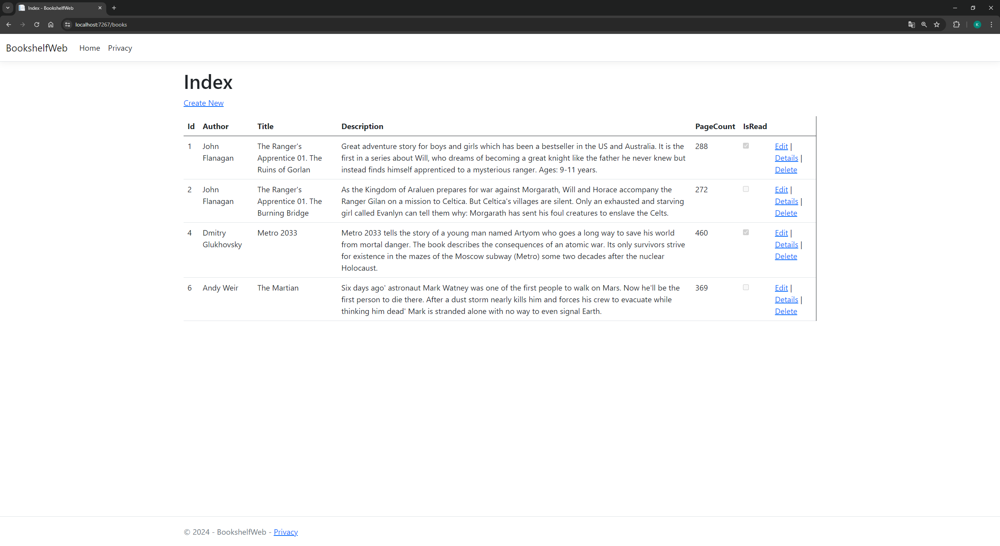
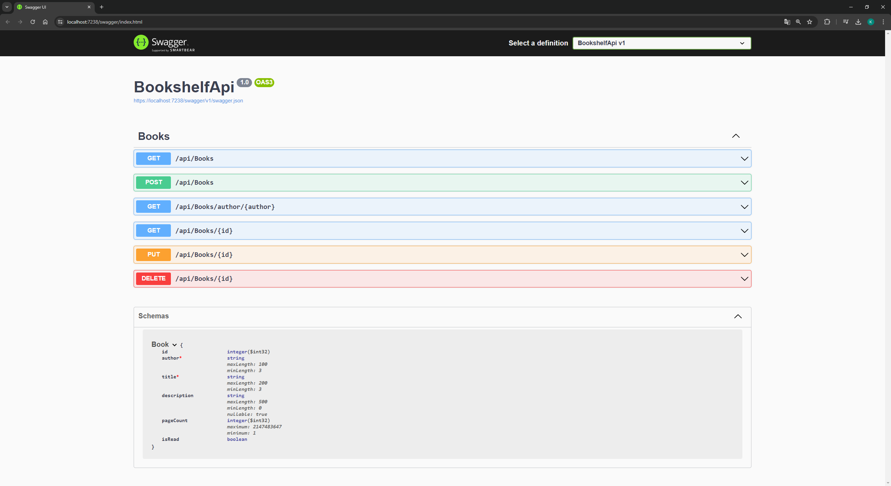
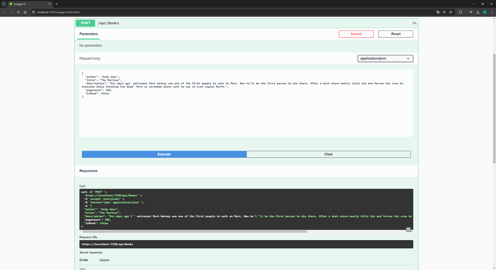
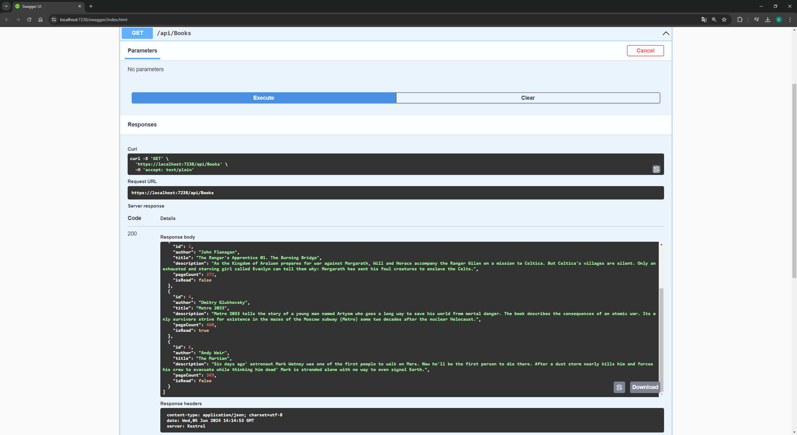

# BookshelfApi

Ten projekt to aplikacja API do zarządzania kolekcją książek. Użytkownik za jej pomocą może zbierać podstawowe informacje o swoim księgozbiorze. Model książki zawiera takie informacje jak: autor, tytuł, opis, liczba stron oraz status przeczytania książki.

Wykonane API umożliwia przeprowadzanie operacji CRUD na danych zawartych w bazie danych. Aplikacja zawiera skonfigurowany Swagger, który został użyty do jej testowania. Projekt został wykonany za pomocą .NET 8 Web API i Entity Framework Core.

Projekt zawiera również prostą aplikację ASP. NET Core MVC, która służy jako aplikacja frontendowa dla użytkownika. Aplikacja "konsumuje" endpoint GET - pobiera listę książek i wyświetla ją użytkownikowi w formie tabeli.

Kamil Zych, grupa: D601

## Kontroler "BooksController":

Kontroler wykorzystuje wzorzec repozytorium, aby oddzielić logikę dostępu do danych od logiki kontrolera. Kontroler obsługuje różne operacje HTTP na zasobach książek:

- GET /api/books: Zwraca listę wszystkich książek.
- GET /api/books/author/{author}: Zwraca listę książek dla konkretnego autora.
- GET /api/books/{id}: Zwraca książkę o podanym identyfikatorze.
- POST /api/books: Dodaje nową książkę do kolekcji.
- PUT /api/books/{id}: Aktualizuje dane istniejącej książki.
- DELETE /api/books/{id}: Usuwa książkę o podanym identyfikatorze.

## Walidacja danych i obsługa błędów:

Aplikacja posiada podstawową weryfikację danych wprowadzanych przez użytkownika. 

Model książki korzysta z wbudowanych atrybutów walidacyjnych, przykładowo właściwość "Author":
```
[Required(ErrorMessage = "Author is required.")]
[StringLength(100, MinimumLength = 3, ErrorMessage = "Author name must be between 3 and 100 characters.")]
public string? Author { get; set; }
```

## Baza danych

Baza danych składa się z jednej tabeli zbudowanej na podstawie modelu książki. 

| Name          | Data type     |
| ------------- | ------------- |
| Id            | int           |
| Author        | nvarchar(100) |
| Title         | nvarchar(200) |
| Description   | nvarchar(500) |
| PageCount     | int           |
| IsRead        | bit           |

Polecenia użyte w terminalu do zbudowania bazy danych:

```
Add-Migration Init
```
```
Update-Database
```

## Frontend

Frontend jest realizowany poprzez aplikację ASP. NET Core MVC. Aplikacja zawiera kontroler "BooksController", który korzysta z HttpClient do pobierania danych z API i przekazywania ich do widoku. 

Kontroler korzysta z automatycznie wygenerowanego widoku Razor, który wyświetla listę książek.

## Zrzuty ekranu:









